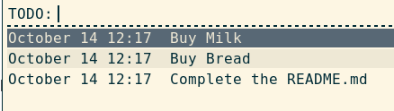
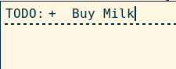
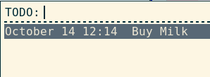
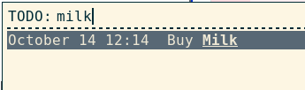

# rofi-todo.sh

Minimal todo client for the [rofi](https://github.com/DaveDavenport/rofi) launcher.

This project is a fork of: http://bijanebrahimi.github.io/blog/rofi-todo.html




# Installation

## i3wm

Add this line to i3 config file. Change `Mod1+P` to the shortcut you want to invoke rofi-todo.sh with.

```
bindsym Mod1+P exec rofi -modi TODO:/path/to/rofi-todo/rofi-todo.sh -show TODO
```


# Usage

## Add TODOs

To add a new todo just start the line with a `+` sign, then press Enter, for example:




You will see:




## Search TODOs

To search through todos just start typing 



## Mark TODOs as done

Use up/down arrows or start typing to select the TODO you want to mark as done, then press Enter.


## Change save file

To change to location of the save file, and also the file which will be searched for the todos you
can set the environment variable `TODO_FILE`:

```
export TODO_FILE=~/.other_todo_file
```

or in a direct shell execution:

```
$ TODO_FILE=~/.other_todo_file rofi -modi TODO:/path/to/rofi-todo/rofi-todo.sh -show TODO
```

 **Note:**  By default todos will be saved to a text file located at `~/.rofi_todos`.

### Save a copy of completed TODOs

To save a copy of your completed TODO items, specify `DONE_FILE`, e.g.:

**~/.profile**
```
export DONE_FILE=~/.rofi_todos_done
```

